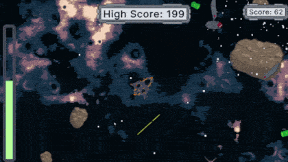
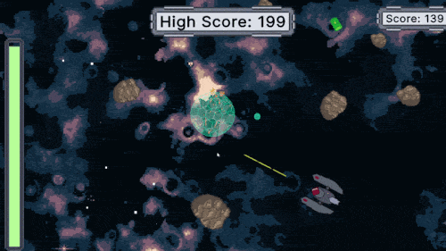
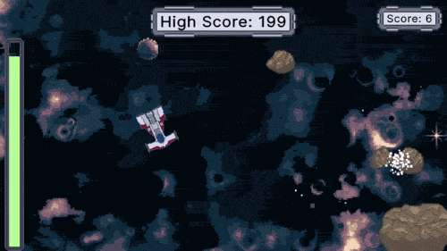
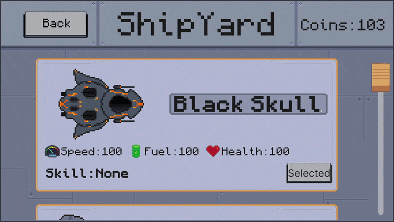

# Cosmic Havoc

A 2D survival game for WebGL. You pilot a ship through an endless field of incoming asteroids and enemy drones. The score is your survival time. The spawn rate increases the longer you last.

Play on [Itch.io](https://rexcattus.itch.io/cosmic-havoc).

## Gameplay

| | |
|:---:|:---:|
|  |  |
|  |  |

## Controls

| Input | Action |
|---|---|
| Hold left mouse button | Thrust toward cursor |
| Space | Fire |
| F | Use ship ability |

Thruster movement consumes fuel. Firing also costs a small amount of fuel. Fuel pickups appear periodically.

## Ships

Four ships are available. The base ship has no active ability. The other three are unlocked with coins earned from survival time (1 coin per 5 seconds).

| Ship | Cost | Ability |
|---|---|---|
| Space Ship 1 | Free | None |
| Space Ship 2 | 200 | Dash: fires the ship forward with an impulse force |
| Space Ship 3 | 300 | Hammerhead: for 5 seconds, colliding with enemies destroys them |
| Space Ship 4 | 400 | Energy blast: pushes nearby enemies away and destroys incoming bullets

## Technical notes

Built with Unity 6 (`6000.0.20f1`), targeting WebGL, using URP 2D and UI Toolkit (UXML/USS).

Player events (`OnPlayerDeath`, `OnPlayerScoreUpdate`, `OnPlayerFuelUpdate`) are C# static Action events. `GameManager` and `CameraShake` subscribe to them rather than being called directly by `PlayerController`. Bullets, rocks, fuel, and shield pickups are managed through a shared `ObjectPooler` to avoid per-frame allocations on WebGL.

## Credits
**Art** — All sprites and animations drawn by the author using [Aseprite](https://www.aseprite.org/). Space background generated with [Space Background Generator](https://deep-fold.itch.io/space-background-generator) by Deep-Fold.

**Music** — [Music Loop Bundle](https://tallbeard.itch.io/music-loop-bundle) by Abstraction. Tracks: Ludum Dare 28 #1, Ludum Dare 28 #3, Ludum Dare 32 #3.

**Sound effects** — Pixel Combat pack by Helton Yan. License: [CC BY 4.0](https://creativecommons.org/licenses/by/4.0/). Some additional sound effects were made with [ChipTone](https://sfbgames.itch.io/chiptone).

## Notes

Portfolio project. All code written by the author. Third-party assets used under their respective licenses as listed above.
